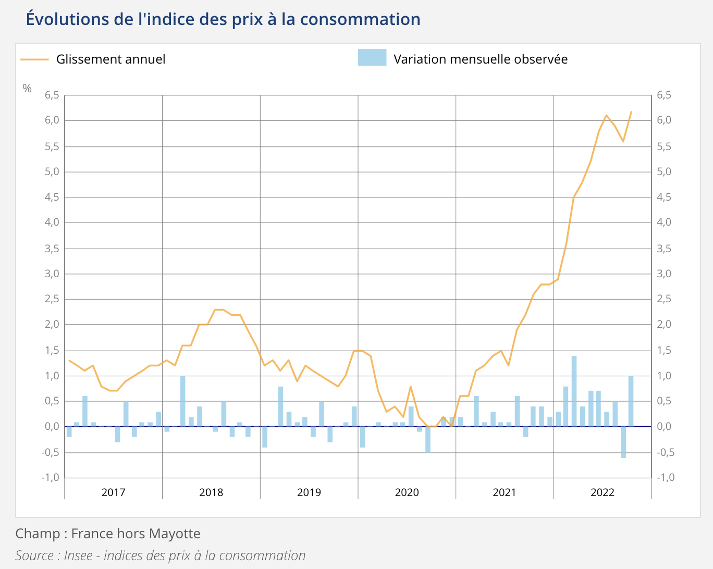

# Maghla: harcèlement, misogynie, montages, obscénités
#### Parole de streameuses harcelées sur Twitch ([lemonde.fr]{.ul}).
«Être streameuse en 2022 est devenu un acte politique», analyse Johanna Soraya Benamrouche du collectif Féministes contre le cyberharcèlement, «parce que quand on est visible en direct et de façon massive dans des communautés aussi figées par la masculinité toxique et la culture du viol, c’est une résistance aux dynamiques patriarcales». La cofondatrice de l’association de sensibilisation aux cyberviolences et aux droits des victimes tranche net: «Il n’y a pas de metoo dans le streaming actuellement. Ça fait des années que les streameuses essaient de s’organiser. Mais la police ne reconnaît pas ce qu’elles subissent comme des violences.» Selon l’enquête du collectif menée par Ipsos, 67% «des victimes de cyberharcèlement qui ont fait la démarche d’aller porter plainte se sont vu refuser ce dépôt».

#### On s'échange du _revenge porn_ comme des cartes Pokémon ([slate.fr]{.ul}).
D'un point de vue social et politique, la diffusion non consentie d'images sexuelles est ancrée «dans les mêmes problèmes structurels que la violence sexuelle, la violence entre partenaires et les autres formes de violence sexiste», avance Ruth Lewis, sociologue et coautrice de Digital Gender-Sexual Violations [«Violences de genre ou sexuelles en ligne», non traduit en français, ndlr]. (...) Si des internautes s'échangent des photos et des vidéos de femmes, ces dernières, en réalité, sont «quasiment immatérielles, elles ne sont qu'une monnaie d'échange». (...) La vraie intention est de se construire une crédibilité, un «statut» entre hommes, observe Ruth Lewis: il s'agit «d'être félicité par d'autres hommes pour avoir réussi à prendre ou diffuser des photos qui sont risquées, qui montrent autant le corps d'une femme sans que celle-ci ne s'en doute».

#### Affaire Bayou: écolo et féministes questionnent l'exemplarité des dirigeants politiques ([mediapart.fr]{.ul}).
Son cas soulève des questionnements inédits, cinq ans après #MeToo. Il interroge le traitement médiatique des «violences psychologiques», une notion mal connue et un phénomène tour à tour minimisé ou au contraire utilisé comme un concept fourre-tout. Il questionne les limites de la vie privée. À quel moment l’écart entre le discours affiché et le comportement dans la sphère intime devient-il d’intérêt public ? Faut-il faire état de cette contradiction ? Où placer le curseur de l’exemplarité d’un responsable politique ? Faut-il conserver comme unique boussole ce qui relève – ou non – d’un délit ou d’un crime ?  
Selon elle, «les féministes sont en droit d’interroger certains comportements masculins du quotidien», surtout quand ils émanent de personnalités progressistes en position de pouvoir.  
<https://www.cairn.info/revue-ethnologie-francaise-2019-2-page-373.htm>. (...) La «dissonance», comme l’appelle Estelle, entre l’engagement en faveur des droits des femmes et son comportement privé, transparaîtrait aussi dans l’axe de défense de Julien Bayou. Plusieurs militantes féministes, même très éloignées de l’affaire, ont été choquées de l’entendre parler de «maccarthysme» ou de le voir choisir une avocate, Marie Dosé, critique du mouvement #MeToo et de la dénonciation du «tribunal médiatique» dans les affaires de violences sexuelles (ici, là, ou encore là). (...) «Pourtant, même si rien ne relève de la faute pénale, il y a a minima un problème d’image. C’est un peu comme si le président du parti animaliste se tapait des entrecôtes tous les week-ends…»

# Les inégalités de niveau de vie se stabilisent
#### Observatoire des inégalités ([inegalites.fr]{.ul}).
Les inégalités de niveau de vie jouent au yoyo en France : une année elles montent, une autre elles descendent. Si on prend un peu de recul, on observe plutôt une tendance à la stabilisation au cours des 15 dernières années, malgré un pic atteint en 2011-2012. Les principaux indicateurs sont en 2020[1] à un niveau proche de 2005. Cette tendance est malgré tout bien fragile.

Par ces 4 indicateurs, les inégalités de niveau de vie n’explosent pas dans notre pays. Il faut néanmoins apporter plusieurs nuances à ce tableau:

1. La tendance historique à la baisse s’est retournée. Les hiérarchies se renforcent.
2. La fragilité des données 2020, soulignée par l’Insee, invite à la prudence.
3. Cette évolution peut masquer des évolutions divergentes selon les catégories. En particulier, le sort des plus âgés s’améliore $\neq$ à l’opposé, les jeunes subissent (...)
4. Enfin, ces données portent toutes sur des indicateurs dit «relatifs» d’inégalité. Dans la vie de tous les jours, on ne se compare pas relativement, mais en euros, de manière dite «absolue», surtout à court terme.

#### La hausse des prix de l'électricité causée par nos dirigeants ([frustrationmagazine.fr]{.ul}).
Le contexte international (l’invasion d’Ukraine par la Russie et les sanctions européennes qui ont suivi) a renchéri le coût du gaz et les tensions dans la production nucléaire en France celui de l’électricité : les prix de l’énergie ont drastiquement augmenté dans tous les pays européens durant l’année 2022, faisant plonger les revenus réels des citoyens, amputés par cette inflation galopante et inarrêtable. Car en effet, cette hausse n’est pas uniquement liée à des paramètres matériels, concrets, comme nombre de médias et de politiques nous le répètent constamment depuis le printemps 2022. Elle dépend principalement de l’emballement spéculatif permis par la constitution du sublime “marché intérieur” européen de l’énergie, où le prix de l’électricité est indexé sur celui du gaz, comme l’expliquait l’économiste Guillaume Etiévant dans nos colonnes : «En ouvrant la concurrence aux intervenants privés (TotalEnergies notamment), qui s’approvisionnent en électricité sur le marché de gros européen, EDF a également dû modifier ses tarifs, qui prennent depuis en compte les prix du marché de gros européen. Sur ce marché, le prix de l’électricité s’ajuste sur le prix du dernier kilowattheure produit. Le gaz est le dernier recours, utilisé en cas de forte demande, quand on a épuisé les ressources tirées des éoliennes, des barrages et du nucléaire. Donc en période de forte consommation d’électricité, comme depuis l’année dernière avec la reprise économique, le prix du gaz a un impact important sur le prix de l’électricité aux consommateurs.» (...) L’Espagne et le Portugal ont quant à eux obtenu une dérogation aux règles européennes : le prix de l’électricité n’est plus lié à celui du gaz. Qu’en sera-t-il de la France et des autres pays de l’UE ? Quand acceptera-t-on de considérer que la concurrence est une mauvaise politique, qui conduit à tout renchérir et compliquer ?

#### Disparités des dépenses d'enseignement sup. selon le genre ([]{.ul}).
Prenant racine dès le plus jeune âge, les stéréotypes de genre infléchissent le parcours scolaire et universitaire des femmes. Elles restent «largement sous-représentées dans certaines filières et disciplines» : moins de 40% des effectifs des grandes écoles, des classes prépas (CPGE), des Instituts universitaires de technologie (IUT) et seulement un cinquième dans les formations universitaires en maths, ingénierie ou informatique. A l’inverse, 89% des inscrits dans les formations paramédicales (infirmière, éducatrice spécialisée, orthophoniste…) sont des femmes et 67 à 72% des effectifs en littérature, arts, langues, sciences sociales et droit sont féminins. Une répartition que la réforme du lycée de 2019 menée par l’ancien ministre de l’Education nationale Jean-Michel Blanquer risque de continuer à accentuer. Une note, publiée début octobre par le collectif Maths & Sciences, révèle «une diminution inédite de la part des filles dans tous les parcours scientifiques» : «En 2021, la part des filles revient à son niveau de 2002, à moins de 45%.»

Cette différenciation des choix de filières et de disciplines en fonction du genre se traduit par des dépenses d’enseignement supérieur inégales : les dépenses consacrées aux étudiantes sont inférieures de 18 % à celles allouées aux étudiants. (...) Les inégalités de genre en matière de dépenses d’enseignement supérieur s’expliquent entièrement par la différenciation des choix d’orientation des femmes et des hommes, qui se traduit par une inégale représentation dans les filières et les disciplines de l’enseignement supérieur.

#### En octobre 2022, les prix à la consommation $\nearrow$ de 6,2 % sur 1 an ([insee.fr]{.ul}).
Sur un an, les prix à la consommation augmenteraient de 6,2 % en octobre 2022, après +5,6 % le mois précédent. Cette hausse de l'inflation serait due à l'accélération des prix de l'énergie, de l'alimentation et des produits manufacturés. Les prix des services et du tabac augmenteraient au même rythme que le mois précédent.

{width=50%}

#### D'où vient l'inflation? ([revolutionpermanente]{.ul}).

# Welcome to hell, Elon
Le rachat de Twitter par Musk a lieu le jour où le «Digital Service Act» est publié
au Journal Officiel de l’Union européenne.

#### Musk aux publicitaires: Twitter “cannot become a free-for-all hellscape” ([]{.ul}).
#### Musk’s Twitter will not be the town square the world needs ([]{.ul}).
#### The bird, the billionaire and the precipice ([]{.ul}).
#### CNBC a rapporté que toute la team ingénierie de Twitter a été licenciée aujourd’hui ([]{.ul}).
#### “Twitter will be forming a content moderation council with diverse viewpoints” ([]{.ul}).
#### Algorithmes et liberté d’expression : mais pourquoi s’inquiéter de la prise de pouvoir d’Elon Musk tout en ignorant les multiples problèmes posés avec ou sans lui par les réseaux sociaux ? ([]{.ul}).

# L'année passée, record de méthane dans l'atmosphère
#### Le monde se dirige vers un réchauffement de 2,5°C à la fin du siècle ([]{.ul}).
#### Dénonçant de l’«écoterrorisme», Darmanin va “s’assurer qu’aucune ZAD ne se construise” à Sainte-Soline ([]{.ul}).
* Y. Jadot chahuté lors de la manifestation anti-bassine dans les Deux-Sèvres, sa voiture vandalisée
* Manif "anti-bassines": environ 2000 manifestants toujours sur place, nouvelle action dimanche après-midi
* Les réserves d'eau sont-elles une bonne solution pour affronter les périodes de sécheresse ?
* Méga-bassines : pourquoi s’y opposer ?

#### La France annonce enfin son retrait du Traité sur la charte de l’énergie ([]{.ul}).
#### Fin des voitures thermiques en 2035 : ce que les constructeurs ont obtenu pour polluer plus ([]{.ul}).

#### La pollution lumineuse en Europe, vue depuis l'espace ([]{.ul}).

# Zuckerberg dans le gouffre du métavers
* Le rapport gouv. sur le métavers prouve que personne ne sait ce qu'est le métavers ([]{.ul}).

#### Meta voit ses profits divisés par 2 au 3^ème^ trimestre ([]{.ul}).
* La valeur de l'action de Meta a été divisée par plus de 3 en 1 an

#### Who killed the social media ad boom? ([]{.ul}).
* Snap, Meta : «Baisse de la publicité et changement de mode se combinent pour former un cercle vicieux, d’où il est bien difficile de sortir»

#### Tech’s biggest companies are sending worrying signals about the economy ([]{.ul}).
* Apple earnings see iPhone revenues up, still short of forecast
* Alphabet third quarter results fall as giant struggles to compete with TikTok
* Alphabet’s Profit Drops 27 Percent From a Year Earlier
* Brutal week for Big Tech with nearly $800bn wiped off valuations
* YouTube’s battle with TikTok takes its toll as revenues dip
* Google’s core business is slowing down amid recession fears

#### Europe prepares to rewrite the rules of the Internet ([]{.ul}).
Le Digital Services Act (DSA) arrive à la fin de son parcours législatif, avec sa publication jeudi 27 octobre au Journal officiel de l’UE

* Le Royaume-Uni ouvre le débat sur la neutralité du Net
* La «modernité» de l’Internet devant la Cour suprême

#### Netflix kicks back at Big Telecom's plan to tax Big Tech in US and EU ([]{.ul}).

# How Google's Ad business funds disinformation ([]{.ul}).
#### New Report Finds that Facebook and TikTok are Approving Ads Containing Political Misinformation ([]{.ul}).
* TikTok va lancer une chaîne _gaming_
* BeReal compterait 20 millions d’utilisateurs actifs quotidiens
* More Americans are getting news on TikTok, bucking the trend on other social media sites

# Wokisme: le racialisme, nouvelle arme des déconstructeurs
Laïcité à l'école : une nouvelle note de l'État confirme la «multiplication» des atteintes

#### «Il n’y a rien de contradictoire à soutenir le droit des femmes à porter un voile en France, et à ne pas en porter en Iran », par Joan W. Scott et Eric Fassin» ([]{.ul}).
#### Immigration : «À Paris, la moitié au moins des faits de délinquance vient de personnes qui sont des étrangers», assure Macron ([]{.ul}).
* Pourquoi il faut rester prudent sur les chiffres de la délinquances à Paris
* Auteurs selon la nationalité (_Insee_)
* Étrangers et délinquances: les chiffres du débat
* Que sait-on réellement du lien entre immigration et délinquance?

#### ([]{.ul}). Critique de J. Naudé sur la vidéo de S. Debove "Peut-on être de gauche et aimer la biologie du comportement humain?" ([]{.ul}).
#### ([]{.ul}). Houria Bouteldja et l'«homophobie soft» ([]{.ul}).
#### Que s’est-il passé avec la dernière vidéo d’Amixem, qui a disparu de YouTube ? ([]{.ul}).

# Examen de la LOPMI: refusons les policiers programmés ([]{.ul}).
#### Internal carrier documents detail SIAM, an Iranian government web program to remotely alter, disrupt, and monitor how the country's people use their phones ([]{.ul}).

---

* 20 lauréats pour la 1^ère^ édition de la French Tech DeepNum20
* Mars: la Nasa doit annoncer une "découverte majeure"
* K. West a été escorté hors d'un bureau à LA après que le rappeur ait débarqué de manière impromptue
* AI-generated art sparks furious backlash from Japan's anime community
  * Révolution: l’intelligence artificielle au service du magazine T
* «On dit de moi que je ne fais que copier-coller les infos des autres. C'est sûrement un boulot moins honorable que la production d’info, mais la revue de presse, c'est une forme de journalisme bien connue» ([Sortir l'info ne suffit plus...]{.ul})
* Covid-19 origins: investigating a "complex and grave situation" inside a Wuhan lab
* Hausse de 28% des atteintes à la probité enregistrées en FR entre 2016–2021
* Fréquentation, âge du public… 5 infographies pour comprendre la crise du cinéma
* Les graphs n'amène pas les gens à inférer des causalités à partir de corrélation
* En France, la Covid longue est officiellement reconnue comme une "maladie psychosomatique" (cf. rapport du COVARS nommé par le gouvernement), en contradiction avec >2000 articles de la littérature scientifique internationale